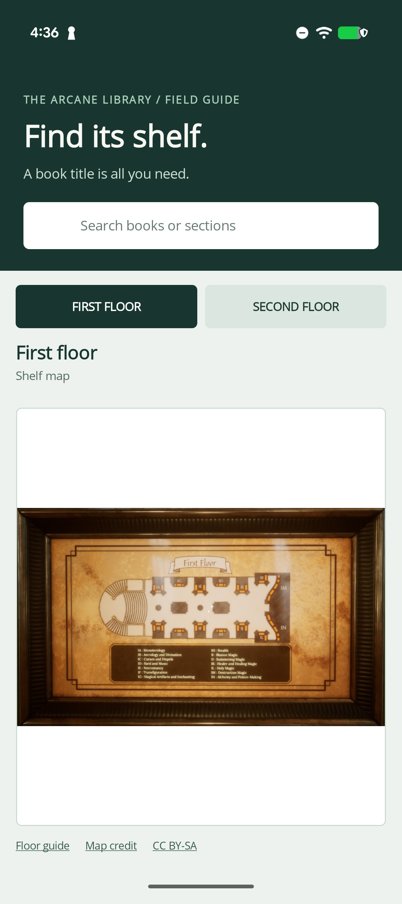
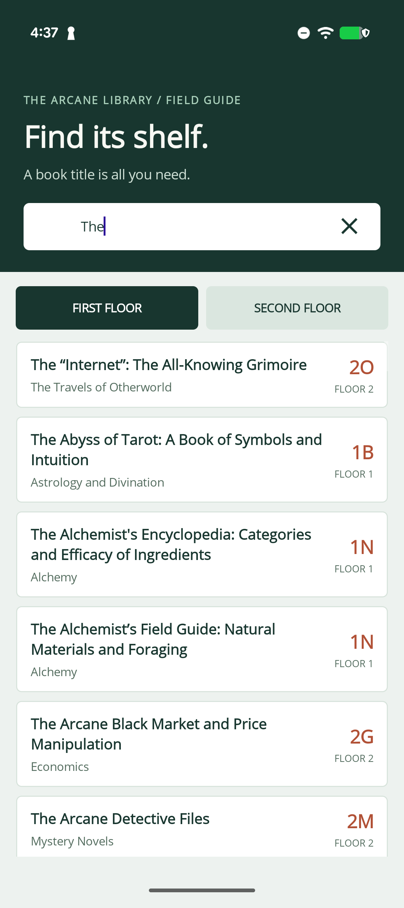
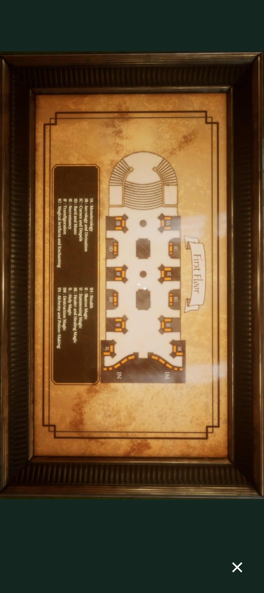

# MAUILibrarian

A .NET MAUI companion for finding books in the Arcane Library from [*Librarian: Tidy Up the Arcane Library*](https://store.steampowered.com/app/4197610/Librarian_Tidy_Up_the_Arcane_Library/). Search by title, section, or shelf to see a book's floor and shelf location, then consult the floor map.

## Features

- Search the bundled book catalog across both library floors, including partial titles and section names.
- Switch between first- and second-floor maps and view them full-screen; pinch to zoom on Android.
- Browse the catalog and maps offline. Source and credit links open in a browser when connected.

## Screenshots

<!-- markdownlint-disable MD033 -->
  
<!-- markdownlint-enable MD033 -->

## Build and run

This app requires the .NET 11 SDK, the .NET MAUI workload, and an Android SDK. Start an Android emulator or connect a device. On Windows, you can install the workload with `dotnet workload install maui`.

From the repository root:

```sh
dotnet run
```

The project currently targets Android. Select an Android device or emulator in your IDE if you prefer to launch it there.

## Data and image credits

The bundled catalog in `Resources/Raw/first_floor.json` and `Resources/Raw/second_floor.json` comes from the [First Floor](https://librarian-tidy-up-the-arcane-library.fandom.com/wiki/First_Floor) and [Second Floor](https://librarian-tidy-up-the-arcane-library.fandom.com/wiki/Second_Floor) pages of the *Librarian: Tidy Up the Arcane Library Wiki*. The maps in `Resources/Images/first_floor.jpg` and `Resources/Images/second_floor.jpg` come from the corresponding [first-floor](https://librarian-tidy-up-the-arcane-library.fandom.com/wiki/File:First_Floor.jpg) and [second-floor](https://librarian-tidy-up-the-arcane-library.fandom.com/wiki/File:Second_Floor.jpg) file pages. See those pages for contributor attribution and file-specific terms, and [Fandom's licensing information](https://www.fandom.com/licensing) for reuse requirements. The app also links to these sources from the floor-map view.

## License

The original application source code is licensed under the [MIT License](LICENSE). The bundled wiki catalog and maps are not covered by the MIT license; see the source pages and licensing terms above for their reuse requirements.
